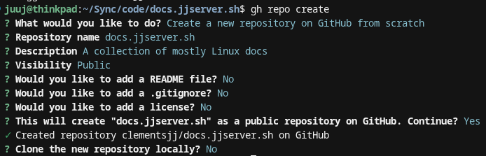
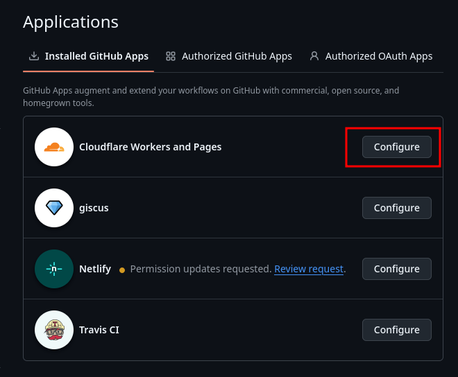
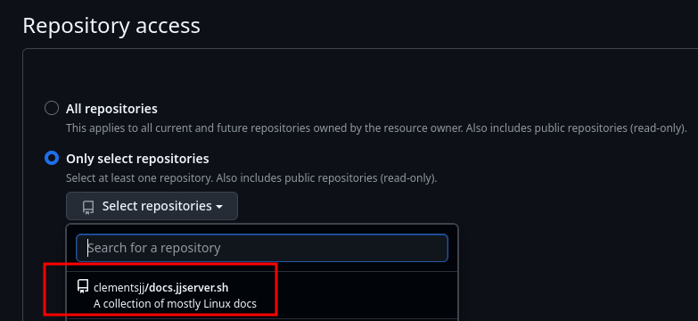
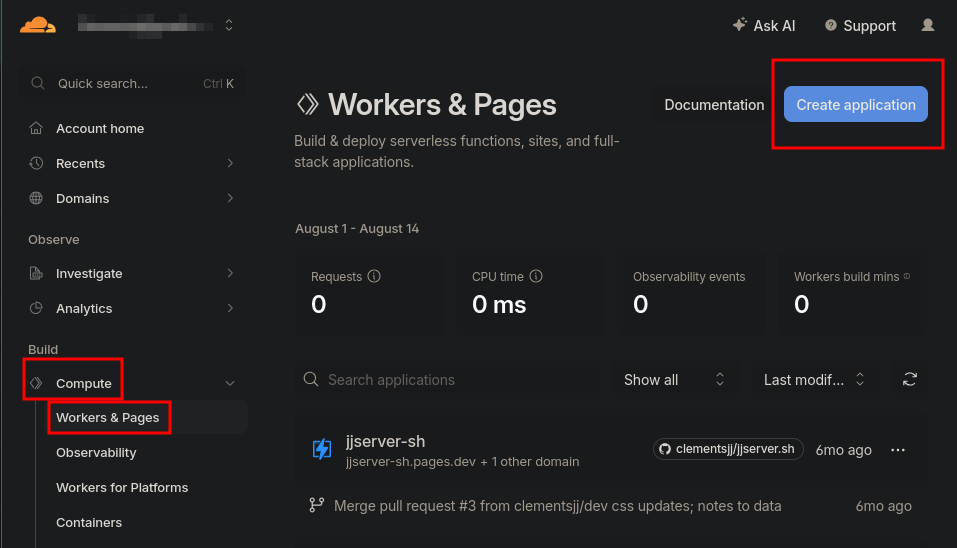
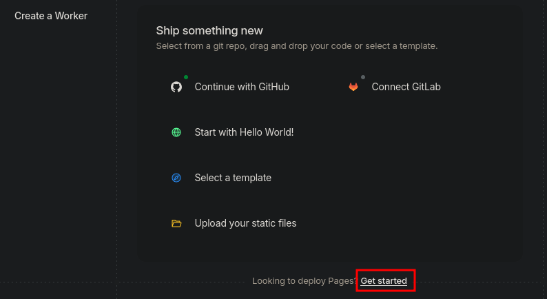
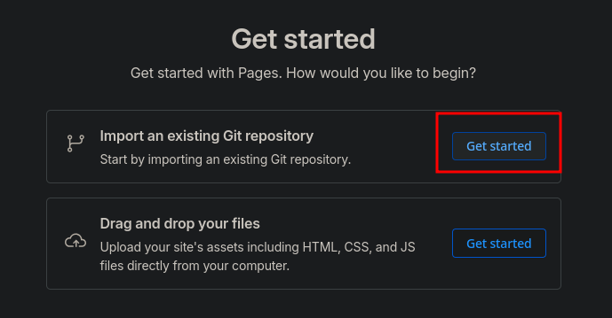
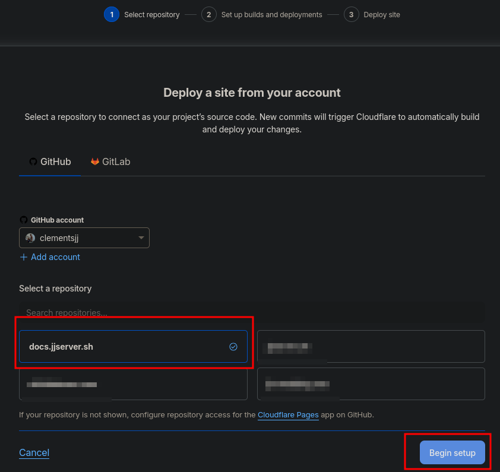
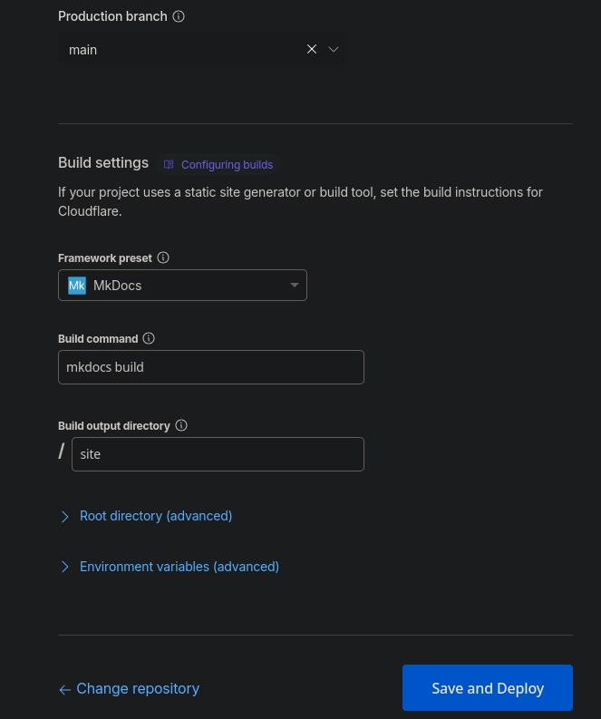
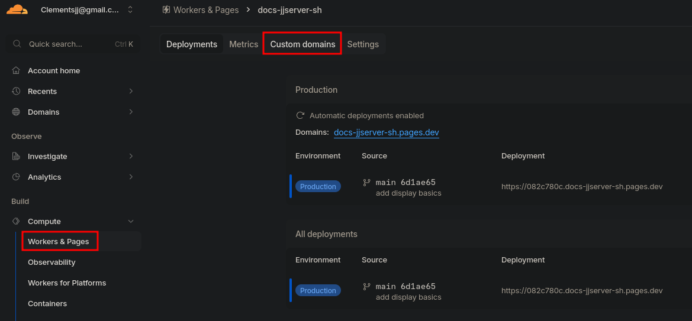
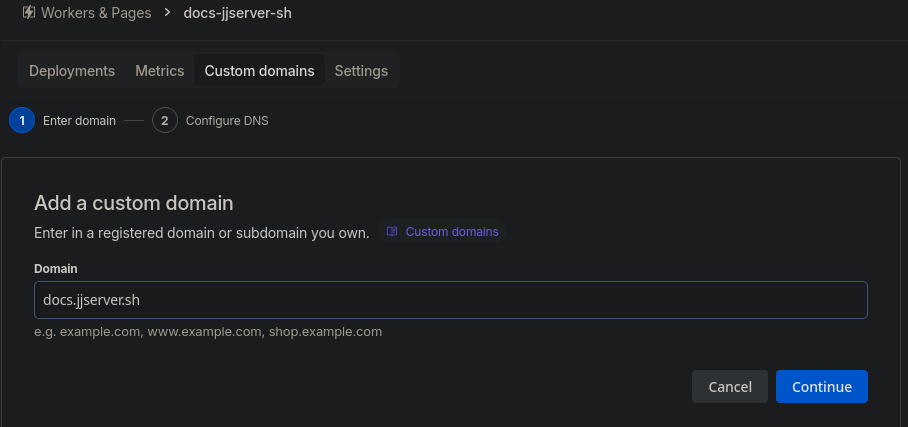

## Prep Github

1. Create .gitignore file
    - add .obsidian, venv/, site/, docs/_site/

2. Create the repository on github
    - `gh auth login`
    - `gh repo create`
    - 
    - Add files and push to repo. 

## Create the Cloudflare Pages Project

Because I am creating a subdomain, I do not have to link the dns servers on Namecheap, so I am skipping that part. 

We only need to add a Pages project and a subdomain. 

3. Open up permissions on github for the repo you want to publish
	- Go to https://github.com/settings/installations
	    - 
	    - 
4. Pages Project
    - Login to Cloudflare -> Workers & Pages  -> Create Application -> Pages 
    - Need to go to "classic Pages", not to e confused with "unified workers"
    - 
    - 
    - 
    - 
    - 

5. Add custom domain
	- 
	- 