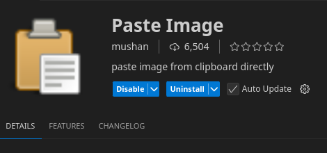
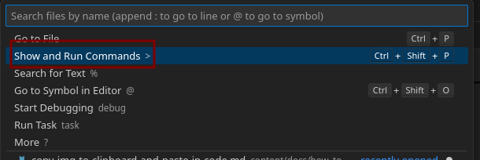
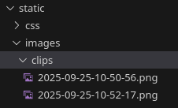
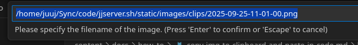

This post will go over *a technique* for pasting images from your clipboard into a markdown file using vs code. This is useful particularly for pasting images to use with Hugo; Using Hugo with pasted images will be the focus of this post. 

---

### 0. Ensure you have VS Code or related installed. 
On Arch, this is `Code - OSS`, the "Official Arch Linux open-source release". 
```
sudo pacman -S code
```

---

### 1. Install the `Paste Image` extension by `mushan`



Out of the box, this will by using `ctrl + alt + v`, or `command + alt + v` on a mac, and will save the image as a png in the current directory. 

So I am using a certain hotkey to take a selected screenshot, more on that later, 
and when I paste it in this doc, it will look like this: 
```

```
And will save the image in the working directory of the doc I am typing on. 
This is fine, but with Hugo, this will not render the image when it is game time. (It should be fine for normal markdown rendering though)

We will need to do a few more steps to have this integrated better with Hugo. 

- Change where the image is saved
    - We want it saved probably in `static/pasted_images` to keep things clean.
- Change the name of the link in markdown to reflect where image is saved. 


> There are actually 2 options here.   
(1)One is to keep your images in the `static` folder and reference them there.   
(2)A second is to make a directory for the markdown post, save the markdown post as `index.md`, and reference the image as is. The second option here does not require any changes to the settings.json.  
--> Just remember to make directory/index.md format if you go with option 2...


----

### 2. Modify settings.json
Hit `shift + ctrl + p` and type settings.json

Or click 


---

### 2.1 Modify settings.json

```json
{
  "pasteImage.path": "${projectRoot}/static/images/clips",
  "pasteImage.forceUnixStyleSeparator": true,
  "pasteImage.namePrefix": "${currentFileNameWithoutExt}-",
  "pasteImage.insertPattern": "",
  "pasteImage.showFilePathConfirmInputBox": false
}
```
And voila! Image appears in static/images/clips



...

- What is **${projectRoot}**?
    - This is from the extension that was installed, and is the base/root of the folder you opened in vscode. 
    - If it is a multi-root workspace, it resolves to the workspace folder that contains the current file.
    - If no workspace and just single file, it will probably do something weird. 
    - If you want a vscode based variable, use `${workspaceFolder}`

- What is `showFilePathConfirmInputBox`? 
    - If you set this to true...you will be presented with the path that the image will save in at the top search box, like so:
    
    Click enter and you have your saved image. 

- These are supported variables for the "Paste Image" extension:
    - `${imageFilePath}, ${imageOriginalFilePath}, ${imageFileName}, ${imageFileNameWithoutExt}, ${currentFileDir}, ${projectRoot}, ${currentFileName}, ${currentFileNameWithoutExt}, ${imageSyntaxPrefix}, ${imageSyntaxSuffix}`


---
### 2.2 Modify settings.json for placing image in same markdown directory

This is the default usage. So you could clear out what you had, or use this: 
```json
{
  "pasteImage.path": "${currentFileDir}",
  "pasteImage.basePath": "${currentFileDir}",
  "pasteImage.forceUnixStyleSeparator": true,
  "pasteImage.namePrefix": "${currentFileNameWithoutExt}-",
  "pasteImage.insertPattern": "",
  "pasteImage.showFilePathConfirmInputBox": false
}
```


