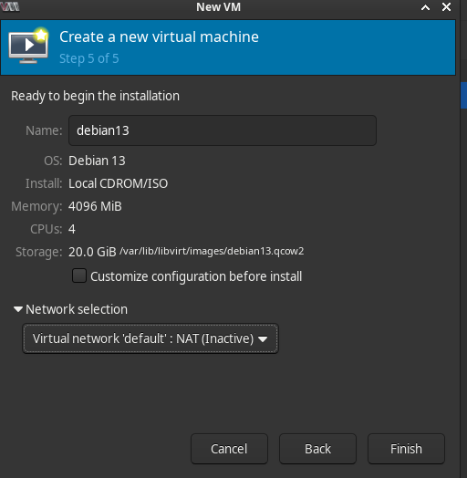
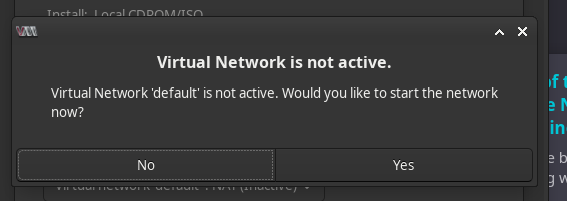
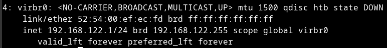

Install Stuff

```bash
sudo pacman -S --needed \
  qemu-base qemu-img libvirt virt-manager virt-viewer \
  dnsmasq iptables-nft edk2-ovmf swtpm bridge-utils
```


User Permissions
```bash
sudo usermod -aG libvirt,kvm $USER
newgrp libvirt   # or log out/in
```


Start libvirtd
```bash
sudo systemctl enable --now libvirtd.service
```


Some Simple Checks
```bash
# Check number of CPUs, anything above 0 is good
egrep -c '(vmx|svm)' /proc/cpuinfo 

# Check kernel modules are loaded
lsmod | grep -E 'kvm_(intel|amd)|kvm'
```


If you launch from this point, you'll see that NAT is inactive. 
If you continue, virt-manager will ask you to activate it. 
Once you do, it should be good to go for the next time you install a vm.



You will see virbr0 when you run `ip a`...



If you want to setup NAT manually before reaching this point, do the following: 

```bash
sudo virsh net-define    /usr/share/libvirt/networks/default.xml 2>/dev/null || true
sudo virsh net-autostart default
sudo virsh net-start default # This is the part that addresses the "inactive" part from the screenshot above
ip a show virbr0   # virbr0 will show up in network interfaces
```


Once launched, use `ctrl + alt` to release mouse...


---

## Bridging the Network
so that you can use normal network IPs and ssh from a different system...

I'll use nmcli, since I am using a gui, this is usually the safe bet. 

1. Identify NIC
    - Use `ip a`
    or
    - `nmcli d | awk '$2=="ethernet"{print $1,$3,$4,$NF}'`

2. Create Bridge
```bash
# Create bridge (no STP for simplicity); make it auto-connect
sudo nmcli con add type bridge ifname br0 con-name bridge-br0 stp no

# Add the NIC as a bridge slave
sudo nmcli con add type bridge-slave ifname enp3s0 master br0
```

3. Move IP/DHCP to bridge
```bash
sudo nmcli con mod bridge-br0 ipv4.method auto ipv6.method auto
sudo nmcli con up bridge-br0
```


#### Rollback
Because I love being able to clean up my mistakes.
```bash
sudo nmcli con down bridge-br0
sudo nmcli con delete bridge-br0
sudo nmcli con delete bridge-slave-enp3s0
sudo nmcli con up <your-old-wired-connection>
```